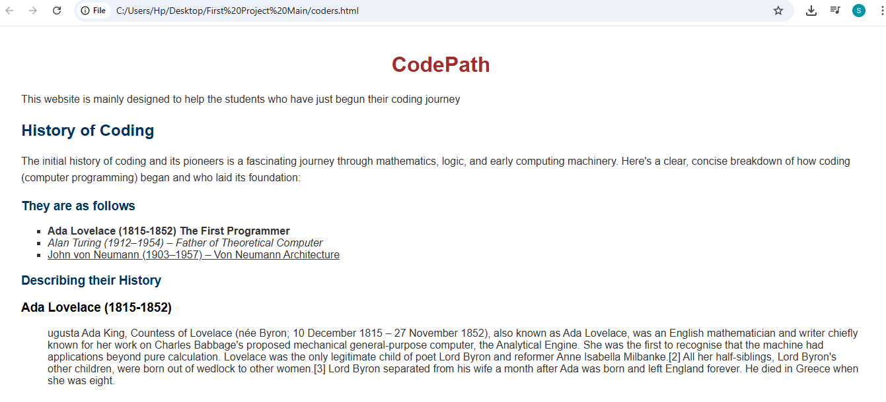

# Code Starter Website

This is my first project in web development, built using pure HTML and basic CSS. It is an educational website that introduces users to the origins of coding, the importance of programming in today’s world, and links to useful platforms for learning to code.

# Features

- Historical background on early coding pioneers like Ada Lovelace and Alan Turing.
- Information on why learning to code is important in 2025.
- A helpful table of free and paid websites for learning programming.
- Clean and simple layout using basic CSS for styling.

# Built With

- HTML5
- CSS3

# Screenshots

# Author

**Parth Kamath**  
Follow my journey: [GitHub Profile](https://github.com/ParthK604)

# Future Improvements

- Add responsive layout for mobile devices.
- Include more coding resources and tutorials.
- Transition to external CSS and use modern layout techniques like Flexbox or Grid.

---

This project marks the beginning of my journey in web development 
